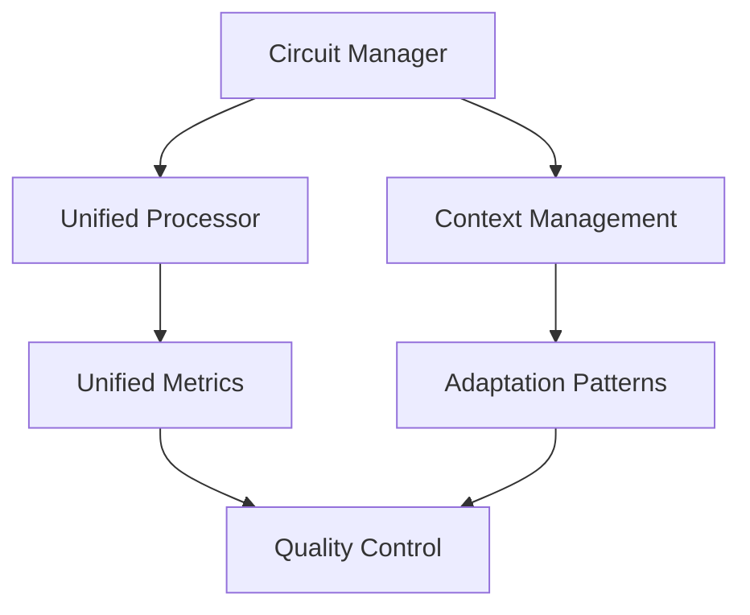

# Système de Génération de Prompts IA

## Vue d'ensemble

Un framework robuste pour la génération et la gestion de prompts IA, avec une architecture modulaire et évolutive.

### Architecture Core



### Composants Principaux

- **Circuit Manager** : Orchestration et flux de données
- **Unified Processor** : Traitement multi-format
- **Context Management** : Gestion contextuelle
- **Adaptation Patterns** : Patterns d'adaptation dynamique
- **Unified Metrics** : Métriques et analytics
- **Quality Control** : Contrôle qualité et validation

## Installation

```bash
git clone [repository]
cd prompting
```

## Structure du Projet

```
prompting/
├── core/
│   ├── circuit_manager.md
│   ├── unified_processor.md
│   ├── context_management.md
│   ├── adaptation_patterns.md
│   ├── metrics/
│   │   └── unified_metrics.md
│   └── versioning/
│       └── version_control.md
├── output/
│   ├── creative_writing_assistant_prompt.md
│   └── python_code_analyzer_prompt.md
└── docs/
    └── instruction.md
```

## Utilisation

1. **Définition du Contexte** : Utilisez `context_management.md`
2. **Création du Prompt** : Suivez les patterns dans `adaptation_patterns.md`
3. **Traitement** : Utilisez `unified_processor.md`
4. **Validation** : Vérifiez avec `quality_metrics.md`

## Maintenance

- Suivi des métriques via `unified_metrics.md`
- Gestion des versions avec `version_control.md`
- Tracking des anomalies via `anomaly_tracker.md`

## Contribution

1. Fork le projet
2. Créez votre branche de feature
3. Committez vos changements
4. Poussez vers la branche
5. Ouvrez une Pull Request

## Versioning

Nous utilisons [SemVer](http://semver.org/) pour le versioning.
